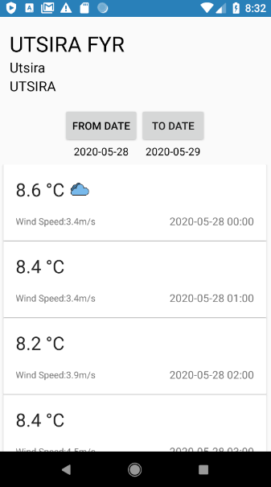
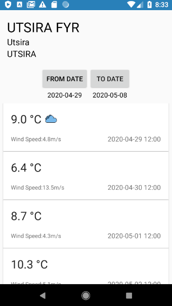

# FrostApp
Native Android - Kotlin - MVVM
-----

Using Frost API, the user can search through municipalities in Norway 
 
and select a station to view the it's weather data. The user also has
 
the option to select the dates they want to view the weather in
 
 

Some ext libraries used in the app:
 
Retrofit
 
Gson
 
okhttp
 
ViewModel and LiveData
 
Recylerview
 
Cardview
 
 
Api used:
 
https://frost.met.no/
 
 
Instructions:
 
Build in Android Studio or
 
Download frost-app.apk in main directory

1. Open app
2. Enter a municipality in Norway
3. Choose a station that you want
4. Enter from-to dates to see more data

 
--
### Screenshots
<h5> Portrait</h5>

 

 

 

 
